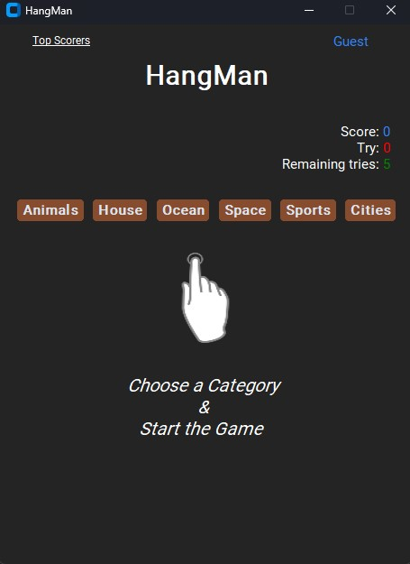
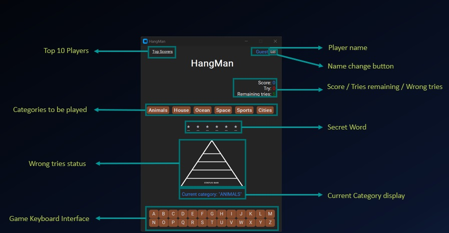

<h1>HANGMAN</h1>
<h2>A version of the Hangman game we all know</h2>
<h3>Install:</h3>

git clone https://github.com/CornelM85/PythonGames.git

<h4>Running the application:</h4>
<ul>
<li>from terminal in Windows, go to Hangman folder and run this command: <b>python main.py</b></li>
<li>from PyCharm -> main.py -> Run</li>
<li>from Hangman/exe_file run <b>hangman.exe</b> standalone executable (Windows only) - sometimes the antivirus software
can recognize the executable files compiled by <b>pyinstaller</b> as a <b>false Trojan virus</b></li>
</ul>
<h4>Technologies used:</h4> 
<ul>
<li>Python 3.12</li>
<li>PyCharm</li>
</ul>
<h4>Libraries used(pip install):</h4>
<ul>
<li>customtkinter 5.2.2</li>
<li>CTKMessagebox 2.5</li>
<li>pillow 10.2.0</li>
</ul>
<h4>Game overview:</h4>

